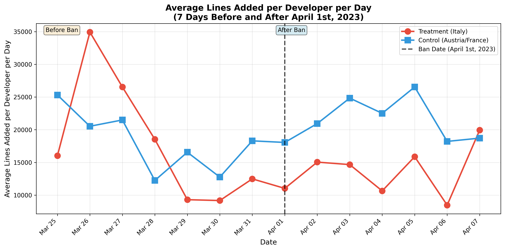
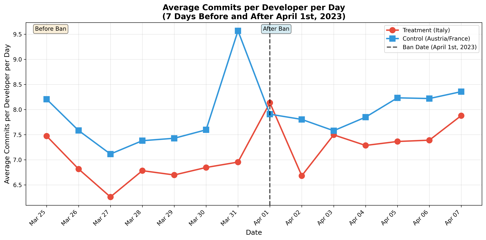

# Progress Report: ChatGPT Ban Impact Analysis

## Commit size analysis

### Data Summary

- **Total commits analyzed**: 4,944,029
- **Countries**: Italy (treatment), Austria and France (control)
- **Unique developers**: 59,399
- **User-day observations**: 633,046
- **Analysis period**: 7 days before and after April 1st, 2023

### Visual Analysis

#### Average Lines Added per Developer per Day

**Summary Statistics:**

- **Treatment Group (Italy)**:
  - Before ban: Mean = 18,138.41 lines/day
  - After ban: Mean = 13,663.47 lines/day (decrease)
- **Control Group (Austria/France)**:
  - Before ban: Mean = 18,168.67 lines/day
  - After ban: Mean = 21,399.11 lines/day (increase)

### Average Commits per Developer per Day

**Summary Statistics:**

- **Treatment Group (Italy)**:
  - Before ban: Mean = 6.83 commits/day
  - After ban: Mean = 7.46 commits/day (slight increase)
- **Control Group (Austria/France)**:
  - Before ban: Mean = 7.84 commits/day
  - After ban: Mean = 7.99 commits/day (slight increase)

### Main DiD Results

#### Overall Treatment Effects

- Standard errors clustered by user (59,399 clusters)
- Day-of-week controls included
- Log-transformed dependent variables to handle skewness

**Log(Commits per Day + 1)**

- Treatment effect (Italy vs Control): -0.0641 (SE: 0.0120, p<0.001) \*\*\*
- Time effect (After vs Before): -0.0077 (SE: 0.0044, p=0.0804)
- **DiD Effect**: -0.0060 (SE: 0.0087, p=0.4920) - **Not significant**

**Log(Lines Added + 1)**

- Treatment effect (Italy vs Control): -0.1307 (SE: 0.0281, p<0.001) \*\*\*
- Time effect (After vs Before): -0.0292 (SE: 0.0118, p=0.0133) \*
- **DiD Effect**: 0.0238 (SE: 0.0231, p=0.3027) - **Not significant**

**Log(Lines Deleted + 1)**

- Treatment effect (Italy vs Control): -0.2511 (SE: 0.0289, p<0.001) \*\*\*
- Time effect (After vs Before): 0.0037 (SE: 0.0116, p=0.7469)
- **DiD Effect**: 0.0042 (SE: 0.0236, p=0.8573) - **Not significant**

**Log(Total Changes + 1)**

- Treatment effect (Italy vs Control): -0.1475 (SE: 0.0283, p<0.001) \*\*\*
- Time effect (After vs Before): -0.0252 (SE: 0.0118, p=0.0327) \*
- **DiD Effect**: 0.0224 (SE: 0.0232, p=0.3334) - **Not significant**

**Key Finding**: The overall DiD analysis shows **no statistically significant effect** of the ChatGPT ban on developer activity, suggesting that the ban did not have a measurable impact on aggregate GitHub activity.

---

### Heterogeneous Effects Analysis

#### Methodology: Defining High vs Low Activity Developers

Developers are classified as high or low activity based on their pre-ban activity levels:

1. **Pre-ban period**: 30 days before the ban (March 2 - March 31, 2023)
2. **Activity metrics calculated**: Average daily values per developer for:
   - Lines added
   - Lines deleted
   - Total changes
   - Number of commits
3. **Composite activity score**: Each metric is normalized to 0-1 scale, then combined with weights:
   - Additions: 30%
   - Deletions: 20%
   - Changes: 30%
   - Commits: 20%
4. **Classification**: Median split - developers above the median activity score are classified as "high activity", those below as "low activity"

This approach ensures that activity levels are based on actual pre-ban behavior rather than post-ban changes, avoiding any bias from the treatment itself.

#### 1. Effects by Developer Activity Level

**Log(Lines Added + 1)**

- **Low Activity Developers**: DiD Effect = 0.0172 (SE: 0.1279, p=0.8932) - Not significant
- **High Activity Developers**: Additional Effect = -0.1334 (SE: 0.0765, p=0.0812) \*
  - Total Effect = -0.1163

**Log(Commits per Day + 1)**

- **Low Activity Developers**: DiD Effect = 0.0253 (SE: 0.0293, p=0.3868) - Not significant
- **High Activity Developers**: Additional Effect = -0.0954 (SE: 0.0210, p<0.001) \*\*\*
  - Total Effect = -0.0700

**Key Finding**: High-activity developers show a **negative effect** (marginally significant for lines added, highly significant for commits), while low-activity developers show no significant effect. This suggests the ban had a larger impact on more active developers.

#### Methodology: Distinguishing Personal vs Organizational Repositories

Repositories are classified as personal or organizational using the following approach:

1. **Primary method**: Use `organization_name` field from enriched CSV data files
   - If `organization_name` exists and is not empty → **Organizational repository**
   - If `organization_name` is missing, empty, or null → **Personal repository**
2. **Fallback method**: If organization data is not available, use a heuristic:
   - Extract repository owner (first part of `repository_name` before `/`)
   - If repository owner matches the username → **Personal repository**
   - Otherwise → **Potentially organizational** (less reliable)

In this analysis, we successfully loaded organization data for 14,751 repository-user pairs from the enriched CSV files, providing a reliable classification for the majority of observations. Repositories without organization data were conservatively classified as personal.

**Note**: Not all organizations are necessarily professional entities (some may be hobby groups or informal collectives).

#### 2. Effects by Repository Type

**Log(Lines Added + 1)**

- **Personal Repositories**: Additional Effect = 0.3110 (SE: 0.1117, p=0.0054) \*\*
  - Total Effect = -0.0206 (not significant)
- **Organizational Repositories**: DiD Effect = -0.3316 (SE: 0.1526, p=0.0298) \*
  - **Significant negative effect**

**Log(Commits per Day + 1)**

- **Personal Repositories**: Additional Effect = 0.1636 (SE: 0.0437, p=0.0002) \*\*\*
  - Total Effect = -0.0081 (not significant)
- **Organizational Repositories**: DiD Effect = -0.1717 (SE: 0.0450, p<0.001) \*\*\*
  - **Highly significant negative effect**

**Key Finding**: **Organizational repositories show a significant negative effect** from the ban, while personal repositories show a positive offset that largely cancels out the negative effect. This suggests organizational repositories were more affected by the ban.

#### 3. Time-Varying Effects (Immediate vs Delayed)

**Log(Lines Added + 1)**

- **Immediate Effect (Days 0-3)**: DiD = -0.0415 (SE: 0.0998, p=0.6775) - Not significant
- **Delayed Effect (Days 4-7)**: DiD = -0.0956 (SE: 0.1036, p=0.3560) - Not significant
- **Later Effect (Days 8+)**: DiD = -0.0531 (SE: 0.0898, p=0.5544) - Not significant

**Log(Commits per Day + 1)**

- **Immediate Effect (Days 0-3)**: DiD = -0.0238 (SE: 0.0234, p=0.3086) - Not significant
- **Delayed Effect (Days 4-7)**: DiD = -0.0221 (SE: 0.0237, p=0.3514) - Not significant
- **Later Effect (Days 8+)**: DiD = -0.0273 (SE: 0.0193, p=0.1570) - Not significant

**Key Finding**: No statistically significant differences between immediate, delayed, and later effects. All time periods show negative but non-significant effects.

---

### Summary

1. **Overall Effect**: No statistically significant overall effect of the ChatGPT ban on aggregate developer activity.

2. **Heterogeneous Effects**:

   - **High-activity developers** were more affected than low-activity developers
   - **Organizational repositories** showed significant negative effects, while personal repositories were less affected
   - No significant differences between immediate, delayed, and later effects
